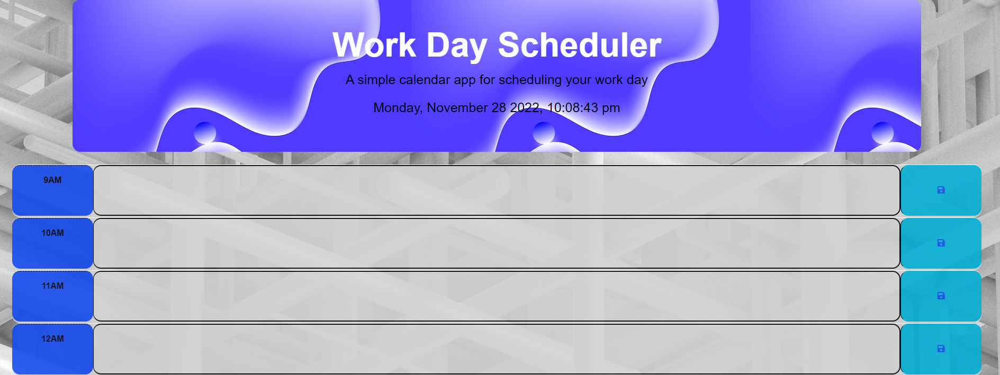

# dayscheduler

## Description

This repository hosts a Workday Scheduler. This program will cover normal business hours between 9am-5pm. The time slots are colored to represent the time tense (past = "grey", present = "red", and future = "green"). The time is implemented at the top of the page and is automatically updated so it moves with you as you create a schedule for the day.

Localstorage has also been implemented so you can insert comments and save them or remove them as you choose. When exiting the program or coming back later the information will persists as long as you wish it to.

## Technologies

- HTML  
- CSS
- JavaScript 
- Jquery

## Credits

- Collaboration and ideas with James Kelly https://www.linkedin.com/in/james-kelly-b93a94150/
- Background and heading photo by https://unsplash.com/@vackground 

## Screenshots (Deployable Page Link)
Deployed page: https://fabien1313.github.io/dayscheduler/

## License

MIT License

Copyright (c) 2022 fabien1313

Permission is hereby granted, free of charge, to any person obtaining a copy
of this software and associated documentation files (the "Software"), to deal
in the Software without restriction, including without limitation the rights
to use, copy, modify, merge, publish, distribute, sublicense, and/or sell
copies of the Software, and to permit persons to whom the Software is
furnished to do so, subject to the following conditions:

The above copyright notice and this permission notice shall be included in all
copies or substantial portions of the Software.

THE SOFTWARE IS PROVIDED "AS IS", WITHOUT WARRANTY OF ANY KIND, EXPRESS OR
IMPLIED, INCLUDING BUT NOT LIMITED TO THE WARRANTIES OF MERCHANTABILITY,
FITNESS FOR A PARTICULAR PURPOSE AND NONINFRINGEMENT. IN NO EVENT SHALL THE
AUTHORS OR COPYRIGHT HOLDERS BE LIABLE FOR ANY CLAIM, DAMAGES OR OTHER
LIABILITY, WHETHER IN AN ACTION OF CONTRACT, TORT OR OTHERWISE, ARISING FROM,
OUT OF OR IN CONNECTION WITH THE SOFTWARE OR THE USE OR OTHER DEALINGS IN THE
SOFTWARE.